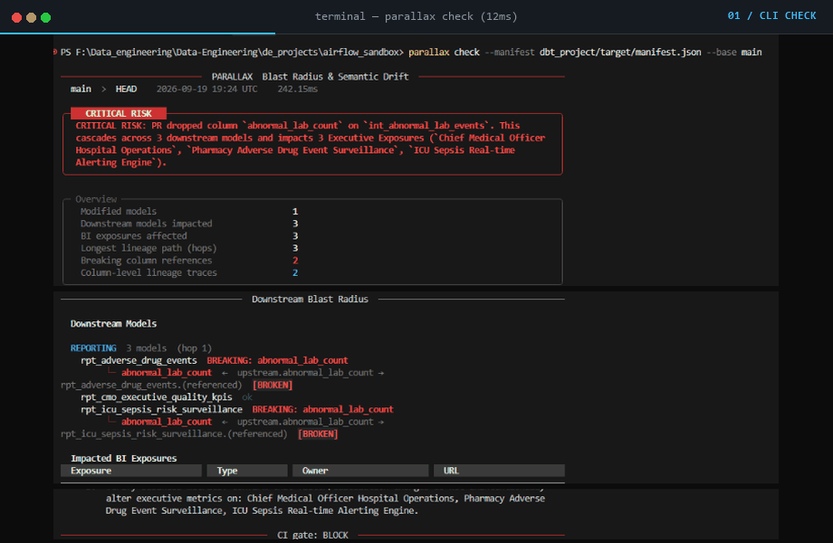
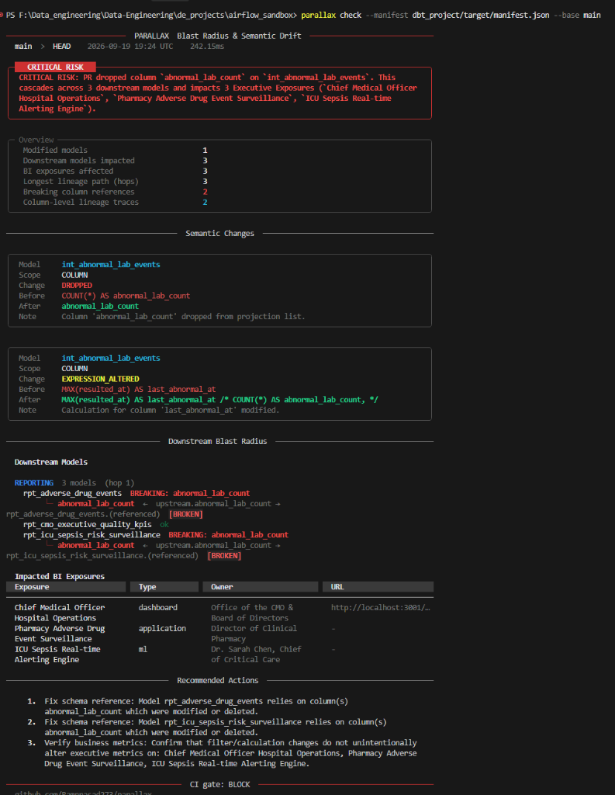
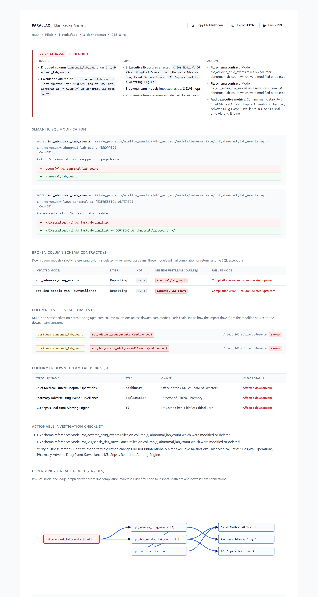
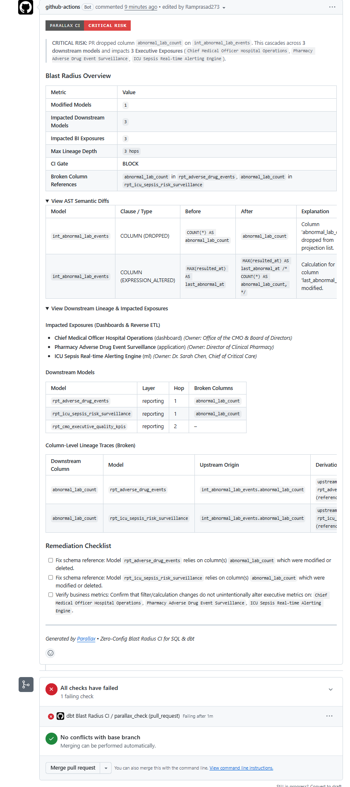

# Parallax

**Zero-Config Blast Radius & Semantic Drift CI for SQL and dbt.**

Parallax helps data and analytics engineering teams catch silent SQL logic regressions and map downstream dashboard dependencies before pull requests are merged.

<p align="center">
  
</p>

---

## What is Parallax?

Parallax is a fast, static analysis command-line tool and CI check designed for SQL and dbt projects. 

Unlike traditional linters that check code style (formatting, comma placement, naming conventions), Parallax parses SQL into Abstract Syntax Trees (ASTs) to detect **semantic shifts** in query logic—such as tightened filters, loosened predicates, dropped columns, or mutated joins—and traces their downstream impact across your dbt Directed Acyclic Graph (DAG) to dependent marts and BI dashboards.

---

## The Problem: Silent Semantic Regressions

Modern data teams rely on SQL linters (e.g. SQLFluff) and schema tests (e.g. dbt `unique`, `not_null`). While valuable, neither tool is designed to detect subtle business logic corruption:

```sql
-- models/staging/stg_orders.sql
- WHERE status NOT IN ('returned', 'cancelled')
+ WHERE status = 'delivered'
```

1. **Linters pass:** Indentation, casing, and syntax are valid.
2. **Schema tests pass:** Delivered orders are still unique and non-null.
3. **The Regression:** The original query included orders with statuses like `'processing'` and `'in_transit'`. The modified filter silently drops them from all downstream tables, skewing financial metrics and executive dashboards while CI remains green.

---

## How It Works

Parallax runs during local development or inside your CI pipeline (such as GitHub Actions) in milliseconds:

1. **AST Semantic Diffing:** Analyzes SQL changes between Git branches using [SQLGlot](https://github.com/tobymao/sqlglot) to isolate functional logic shifts from superficial formatting.
2. **Lineage Traversal:** Ingests dbt's compiled `target/manifest.json` and uses [NetworkX](https://networkx.org/) to traverse downstream models (Intermediate, Marts, Reporting) and identify impacted BI exposures (Looker, Tableau, Hex, Reverse-ETL syncs).
3. **Deterministic Risk Evaluation:** Computes an objective risk severity score and generates concrete remediation recommendations without relying on nondeterministic or external AI services.

---

## End-to-End Workflow

Parallax provides automated blast radius defense across every stage of development:

<details open>
<summary><b>1. Local Pre-Commit Scan &mdash; <code>parallax check</code></b></summary>
<br>

Run instantly in your local development terminal before opening a pull request. Compares your branch against `main` in milliseconds without touching the data warehouse:

- **Semantic AST Detection:** Catches tightened filters, dropped columns, and altered calculations.
- **Immediate Terminal Feedback:** Flags `CRITICAL RISK` and lists breaking downstream references before code leaves your machine.

<p align="center">
  <a href="assets/images/cli-report.png"></a>
</p>

</details>

<details open>
<summary><b>2. Interactive Standalone Report &mdash; <code>parallax report</code></b></summary>
<br>

Generates a zero-dependency, self-contained HTML artifact with browser-based interactive exploration:

- **Deterministic DAG Lineage:** Visualizes the full path from modified upstream models to impacted Looker/Tableau dashboards.
- **Broken Column Contracts:** Lists exact downstream models that will fail compilation or throw runtime exceptions.
- **Column-Level Lineage Chains:** Multi-hop provenance tracing for modified metrics.

<p align="center">
  <a href="assets/images/html-report.png"></a>
</p>

</details>

<details open>
<summary><b>3. Automated GitHub Actions CI Gate</b></summary>
<br>

Runs inside your GitHub Actions pipeline on pull requests with zero warehouse credentials or staging databases:

- **Automated PR Audits:** Posts actionable, structured blast radius summaries directly onto pull requests.
- **Merge Protection:** Automatically fails status checks (`CI Gate: BLOCK`) on breaking schema drifts or critical exposure regressions.

<p align="center">
  <a href="assets/images/github-ci-pr.png"></a>
</p>

</details>

---

## Core Design Principles

| Tenet | Description |
| :--- | :--- |
| **Static Analysis by Design** | Operates strictly on local SQL code and dbt metadata. Requires no database credentials, creates no staging tables, and incurs no cloud warehouse query costs. |
| **In-Memory Graph Traversal** | Resolves dependencies and lineage paths entirely in memory using NetworkX, avoiding database roundtrips or query latencies. |
| **Signal-to-Noise Priority** | Non-semantic changes (such as whitespace alterations, comment edits, or internal alias updates) are recognized as zero-risk, avoiding unnecessary pull request noise. |
| **Deterministic Rules** | Generates plain-English summaries using rule-based algorithmic synthesis, ensuring consistent and reproducible CI results. |

---

## Project Status & Disclaimer

Parallax is open-source software licensed under the [Apache License, Version 2.0](https://www.apache.org/licenses/LICENSE-2.0). 

> **Important Notice:** Parallax performs static syntactic and structural analysis based on SQL ASTs and dbt metadata artifacts. It does not inspect runtime warehouse data rows or validate dynamic query execution plans. As provided under the Apache 2.0 license, this tool is distributed on an "AS IS" BASIS, WITHOUT WARRANTIES OR CONDITIONS OF ANY KIND. Teams should use Parallax as an automated safety layer alongside comprehensive code review and automated integration testing.

---

## Next Steps

- [Quickstart Guide](quickstart.md): Install and run your first scan in under a minute.
- [Sample Report & Interpretation](sample-report.md): Learn how to read and interpret Parallax reports.
- [CI/CD Integration](cicd/github-actions.md): Set up automated PR checks with GitHub Actions.
- [Security & Compliance](reference/compliance-and-security.md): Review data privacy, security posture, and limitations.
